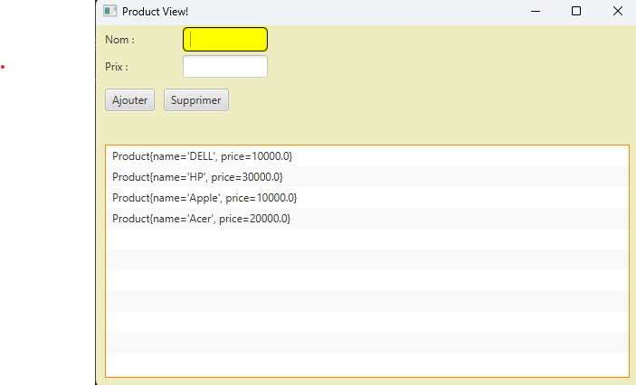
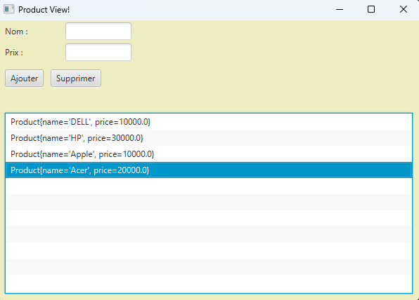
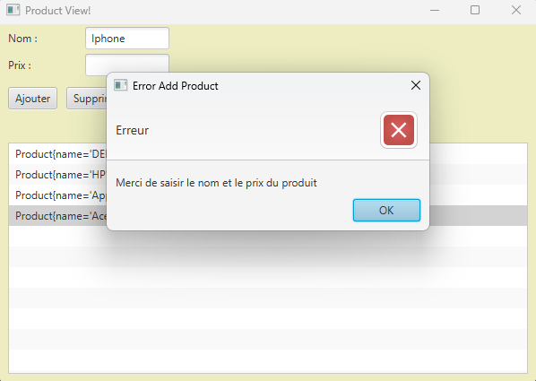

<h3>Product view </h3>
<ul>
    <li>Pour ajouter un produit : Entrer le nom et le prix du produit </li>
    <li>Pour supprimer un produit : Selectionner le produit dans la liste  </li>
</ul>
<table>
<th>Action</th>
<th>Resultat</th>
<tr>
<td>Ajout d'un produit </td>
<td></td>
</tr>
<tr>
<td>Suppression d'un produit </td>
<td></td>
</tr>
<tr>
<td>Erreur d'ajout d'un produit </td>
<td></td>
</tr>
<tr>>
<td>Erreur de suppression d'un produit </td>
<td></td>
</tr>
</table>